## Содержание
- [Содержание](#содержание)

- [**Линейная алгебра: векторы**](#линейная-алгебра-векторы)
  - [Определение вектора](#определение-вектора)
  - [Операции над векторами](#операции-над-векторами)
    - [Определение направления вектора](#определение-направления-вектора)
    - [Вычисление длины вектора](#вычисление-длины-вектора)
    - [Сложение и вычитание векторов](#сложение-и-вычитание-векторов)
    - [Умножение вектора на константу](#умножение-вектора-на-константу)
    - [Транспонирование вектора](#транспонирование-вектора)
    - [Скалярное произведение векторов](#скалярное-произведение-векторов)
    - [Векторное произведение векторов](#векторное-произведение-векторов)
    - [Вычисление расстояния между векторами](#вычисление-расстояния-между-векторами)
  - [Реализация в Python](./vectors.ipynb)

- [**Линейная алгебра: матрицы**](#линейная-алгебра-матрицы)
  - [Определение матрицы](#определение-матрицы)
  - [Операции над матрицами](#операции-над-матрицами)
    - [Сложение и вычитание матриц](#сложение-и-вычитание-матриц)
    - [Умножение матрицы на константу](#умножение-матрицы-на-константу)
    - [Транспонирование матрицы](#транспонирование-матрицы)
    - [Произведение матриц](#произведение-матриц)
    - [Использование единичной и обратной матриц](#использование-единичной-и-обратной-матриц)
    - [Выявление мультиколлинеарности в данных](#выявление-мультиколлинеарности-в-данных)
  - [Ранг матрицы](#ранг-матрицы)
  - [Определитель матрицы](#определитель-матрицы)
  - [Реализация в Python](./matrices.ipynb)

- [**Математический анализ: функции**](#математический-анализ-функции)
  - [Определение функции](#определение-функции)
  - [Свойства функций](#свойства-функций)
  - [Графики часто используемых функций](#графики-часто-используемых-функций)
    - [Линейная функция](#линейная-функция)
    - [Квадратичная функция](#квадратичная-функция)
    - [Кубическая функция](#кубическая-функция)
    - [Гиперболическая функция](#гиперболическая-функция-функция-обратной-пропорциональности)
    - [Тригонометрическая функция синус](#тригонометрическая-функция-синус)
    - [Тригонометрическая функция косинус](#тригонометрическая-функция-косинус)
    - [Показательная функция](#показательная-функция)
    - [Логарифмическая функция](#логарифмическая-функция)
  - [Обратные функции](#обратные-функции)
  - [Реализация в Python](./functions.ipynb)

- [**Математический анализ: производные**](#математический-анализ-производные)
  - [Определение производной](#определение-производной)
  - [Определение градиента](#определение-градиента)
  - [Недифференцируемые функции](#недифференцируемые-функции)
  - [Правила дифференцирования](#правила-дифференцирования)
  - [Производные часто используемых функций](#производные-часто-используемых-функций)
  - [Реализация в Python](./derivatives.ipynb)

- [**Заметки**](#заметки)
  - [Функция потерь](#функция-потерь)

# Линейная алгебра: векторы
## Определение вектора

**Вектор** — это математический объект, который имеет длину и направление в пространстве. Он может быть использован для представления физических величин — силы, скорости, ускорения и многих других.

В машинном обучении векторы — одно из основных понятий, которое используется для представления данных. Например, вектор может представлять цвет изображения в RGB-формате, размер объекта на изображении, частоту звука или другие характеристики данных. Векторы также используются в алгоритмах машинного обучения для выполнения операций классификации, кластеризации и регрессии.

Кроме того, векторы могут использоваться для решения задач оптимизации. Каждый объект может быть представлен в виде вектора признаков, где каждый элемент вектора соответствует определенному признаку объекта.

Векторы могут быть обработаны с помощью различных методов машинного обучения — линейной регрессии, метода опорных векторов, нейронных сетей, деревьев решений и других.

При обучении моделей машинного обучения векторы используются для поиска закономерностей, связей и корреляций между признаками, которые могут быть использованы для прогнозирования или классификации новых данных. Векторы используются для создания матрицы признаков, которая является основным входом для большинства алгоритмов машинного обучения. В Python распространенный способ представления вектора — это одномерный массив numpy.

Векторы обычно обозначаются либо с помощью жирного шрифта, либо с помощью стрелки над символом:
$v$
 или
 $\vec{v}$.
 В общем случае в
$n$
-мерном пространстве вектор представляется как набор из
$n$
 чисел.

Компоненты вектора могут быть действительными или комплексными числами. Для записи компонент вектора обычно используют формат столбца (вектор-столбец), где каждый элемент записывается в новой строке:
$$
\LARGE
\mathbf{v} = \vec{v} = \begin{bmatrix}
v_1 \\
v_2 \\
\vdots \\
v_n
\end{bmatrix}
$$
Элементы вектора
$v_1, v_2, v_3, \ldots,v_{n−1},v_n$
называются его координатами или компонентами. Размерностью вектора является количество его компонент.

Существует связь между понятием вектора в
$n$
-мерном пространстве и упорядоченной последовательностью действительных чисел
$v_1, v_2, v_3, \ldots,v_{n−1},v_n$
.

В двумерном пространстве вектор может быть представлен как пара чисел
$(v1, v2)$
, где
$v1, v2$
 могут быть интерпретированы как координаты $x, y$
на плоскости.

В трехмерном пространстве векторы задаются с помощью трех координат. Векторы большей размерности не могут быть визуализированы.

    
     
    <em>
    <b>(1)</b> — Вектор с координатами (5, 3) в двумерном пространстве, <b>(2)</b> — несколько векторов в трехмерном пространстве
    </em>
     
     

Некоторые типы векторов имеют собственные названия. Например, нулевой вектор — это вектор, все компоненты которого равны нулю:

$$
\LARGE
\vec{0} = \begin{bmatrix}
0 \\
0 \\
\vdots \\
0
\end{bmatrix}
$$

В __машинном обучении__ принято задавать векторы с помощью только одной точки в заданном векторном пространстве. Соответственно, полагается, что __начало всех векторов находится в точке начала координат__. Такая интерпретация векторов делает интуитивно понятными различные операции над векторами. Например, вычисление угла между двумя векторами.

    
     
    <em>
    Два вектора, исходящих из начала координат
    </em>
     
     

Рассмотрим основные свойства векторов и их геометрический смысл.

## Операции над векторами

### Определение направления вектора
Направление вектора определяется по направлению от его начала к концу. Другими словами, направление вектора — это угол, под которым он направлен относительно некоторой начальной точки (обычно начало координат) в пространстве. Обычно угол измеряется в градусах или радианах. Например, для вектора с координатами $(5, 4)$, угол между горизонтальной осью и вектором может быть найден, используя тангенс угла наклона, который равен $4/5$.

Чтобы определить угол по тангенсу, можно воспользоваться обратной функцией тангенса — арктангенсом (или тангенсом в -1 степени). Обозначается арктангенс как
$\arctan$
 или
$\tan^{−1}$
. Если дано значение тангенса угла
$\alpha$
, то угол
$\alpha$
 можно найти следующим образом:
$$\alpha = \arctan(\tan{\alpha})$$

Например, если дано, что
$\tan{\alpha} = 4/5$
, то угол
$\alpha$
 можно найти следующим образом:
$$\alpha = \arctan(0.8) \approx 38.659^\circ$$

Однако необходимо помнить, что арктангенс имеет ограничения на область значений и может возвращать только углы в определенном диапазоне значений. Например, для обычной арктангенс-функции область значений ограничена значениями
$-\frac{\pi}{2} < \arctan(x) < \frac{\pi}{2}$
. То есть функция возвращает только углы, лежащие в этом диапазоне.

Если необходимо получить угол, лежащий в другом диапазоне, можно использовать дополнительные математические операции. Например, добавлять или вычитать $\pi$
 ( 180 градусов) из значения арктангенса в зависимости от того, в какой четверти находится искомый угол.

Соответственно, направление вектора с координатами
$(5, 4) равно \approx 38.659^\circ$
.

    
     
    <em>
    Направление вектора, выраженное в градусах
    </em>
     
     

### Вычисление длины вектора
Каждый вектор в векторном пространстве, кроме 0 -вектора, имеет длину. Длина обозначается термином __норма__.

Существуют несколько способов определения нормы векторов, но все они моделируют расстояния, которые мы используем в повседневной жизни.

Один из способов — это __L1-норма__ (расстояние городских кварталов, манхэттенская метрика/норма), которая соответствует расстоянию, которое бы проехал автомобиль между начальной и конечной точками по городским улицам, расположенным под углом
$90^\circ$
.

Это расстояние находится путем перемещения только вдоль осей координат:
$$
\LARGE
\| \vec{v} \|_1 = \left( \sum_{i=1}^d |v_i|^1 \right)^{\frac{1}{1}}
$$

Здесь
$v$
— вектор размерности
$d$
.

В этой формуле происходит суммирование модулей всех координат. Корень 1-й степени означает отсутствие математических действий над выражением и используется лишь для унификации с метрикой Минковского.

К примеру, расстояние от точки (0, 0) до точки (5, 4) может быть пройдено по разным траекториям. Но общее расстояние останется равным 9.

Другой способ — это __L2-норма__ (Евклидова длина вектора или Евклидова норма). Она соответствует расстоянию, которое пролетел бы вертолет между началом координат и точкой вектора. Это расстояние находится по теореме Пифагора. Сначала происходит суммирование квадратов всех координат, а затем вычисляется корень 2-й степени из этой суммы:
$$
\LARGE
\| \vec{v} \|_2 = \left( \sum_{i=1}^d |v_i|^2 \right)^{\frac{1}{2}}
$$
или
$$
\LARGE
\| \vec{v} \|_2 = \sqrt{\sum_{i=1}^d |v_i|^2}
$$

Здесь
$v$
— вектор размерности
$d$
.

L2-норма является более популярной по сравнению с L1-нормой, потому что она более естественна для измерения длины.

    
     
    <em>
    Способы вычисления длины вектора
    </em>
     
     

__Общая же формула нормы вектора__ в
$\mathbb{R}^d$
носит название __Lp-нормы__ (нормы Минковского) и вычисляется по формуле:
$$
\large
\| \vec{v} \|_p = \left( \sum_{i=1}^d |v_i|^p \right)^{\frac{1}{p}}
$$

Здесь
- $\vec{v} = (v_1, v_2, \dots, v_d)$ — вектор в $\mathbb{R}^d$,
- $p \geq 1$ — порядок нормы (чаще всего $p \in \{1, 2, \infty\}$).

**Частные случаи:**
- $p=1$: Манхэттенская норма $\| \vec{v} \|_1 = \sum |v_i|$
- $p=2$: Евклидова норма $\| \vec{v} \|_2 = \sqrt{\sum |v_i|^2}$
- $p \to \infty$: Максимальная норма $\| \vec{v} \|_\infty = \max_i |v_i|$

$$
p \to \infty: \quad \| \vec{v} \|_\infty = \lim_{p \to \infty} \left( \sum_{i=1}^d |v_i|^p \right)^{1/p} = \max_i |v_i|
$$

Запись
$\mathbb{R}^d$
означает, что мы рассматриваем векторы, элементы которых являются числами из множества действительных чисел
$\mathbb{R}$
, и каждый вектор имеет
$d$
компонент (или размерность
$d$
). Таким образом, векторы в
$\mathbb{R}^d$
можно записать в виде упорядоченных наборов чисел вида
$(x_1, x_2, \ldots, x_d)$
, где каждое
$x_i$
принадлежит множеству действительных чисел
$\mathbb{R}$
.

Примеры:

- Вектор $(2,5,−3)$ принадлежит векторному пространству $\mathbb{R}^3$.
- Вектор $(1,0,−2, 5)$ принадлежит векторному пространству $\mathbb{R}^4$.

### Сложение и вычитание векторов
Векторы, так же как и числа, можно складывать:
$$
\vec{v_1} + \vec{v_2} =
\begin{bmatrix}
v1_{1} \\
v1_{2} \\
\vdots \\
v1_{n}
\end{bmatrix}
+
\begin{bmatrix}
v2_{1} \\
v2_{2} \\
\vdots \\
v2_{n}
\end{bmatrix}
=
\begin{bmatrix}
v1_{1} + v2_{1} \\
v1_{2} + v2_{2} \\
\vdots \\
v1_{n} + v2_{n}
\end{bmatrix}
$$

И вычитать друг из друга, получая новые векторы:

$$
\vec{v}_1 + (- \vec{v_2}) =
\begin{bmatrix}
v1_{1} \\
v1_{2} \\
\vdots \\
v1_{n}
\end{bmatrix}
+
\begin{bmatrix}
- v2_{1} \\
- v2_{2} \\
\vdots \\
- v2_{n}
\end{bmatrix}
=
\begin{bmatrix}
v1_{1} - v2_{1} \\
v1_{2} - v2_{2} \\
\vdots \\
v1_{n} - v2_{n}
\end{bmatrix}
$$

где $\vec{v}_1 = (v1_{1}, v1_{2}, \dots, v1_{n})$, $\vec{v}_2 = (v2_{1}, v2_{2}, \dots, v2_{n})$ — векторы в $\mathbb{R}^n$.

Например, чтобы сложить вектор
$\vec{v1}$
с координатами
$(4,7)$
(на рисунке
$\color{red}\text{красного цвета}$
) и вектор
$\vec{v2}$
с координатами
$(8,4)$
(на рисунке
$\color{blue}\text{синего цвета}$
), нужно просто сложить их соответствующие координаты, и тогда получится новый вектор
$\vec{v1 + v2}$
с координатами
$(12,11)$
(на рисунке
$\color{green}\text{зеленого цвета}$
).

Геометрически это можно представить так: суммарный вектор является диагональю параллелограмма, образованного векторами.

Вычитание происходит аналогичным образом, только используется другая диагональ параллелограмма. Например, разность между векторами
$\vec{v1}$
(4,7) (на рисунке (2)
$\color{red}\text{красного цвета}$
) и
$\vec{v2}$
(8,4) (на рисунке (2)
$\color{blue}\text{синего цвета}$
) вычисляется также поэлементно, получается вектор
$\vec{v1 - v2}$
(на рисунке (2)
$\color{green}\text{зеленого цвета}$
) с координатами (−4,3):

    
     
    <em>
    (1) — Сложение векторов, (2) — вычитание векторов
    </em>
     
     

Свойства сложения векторов. Для любых векторов одинакового размера выполнено:

 - $\vec{v1} + \vec{v2} = \vec{v2} + \vec{v1}$
(коммутативность сложения).

 - $(\vec{v1} + \vec{v2}) + \vec{v3} = \vec{v1} + (\vec{v2} + \vec{v3})$
(ассоциативность сложения).

### Умножение вектора на константу
Умножение вектора на константу — это поэлементное умножение компонент вектора на данную константу:
$$
c\vec{v} = c
\begin{bmatrix}
v_1 \\
v_2 \\
\vdots \\
v_n
\end{bmatrix}
=
\begin{bmatrix}
c \cdot v_1 \\
c \cdot v_2 \\
\vdots \\
c \cdot v_n
\end{bmatrix}
$$

Умножение вектора на константу приводит к изменению длины вектора и/или его направления, в зависимости от значения константы. Геометрический смысл умножения вектора на константу следующий:

    
     
    <em>
    (1) — константа положительная, умножение приводит к увеличению длины вектора, направление не меняется; (2) — константа отрицательная, длина вектора также увеличивается, но направление меняется на противоположное
    </em>
     
     

Умножение вектора на число может использоваться для масштабирования векторов в графическом программировании, изменения скорости или ускорения объектов в физических симуляциях, применения линейных преобразований в линейной алгебре и т. д.

Свойства умножения вектора на константу. Для любого вектора выполнено:

 - $c \cdot \vec{v} = \vec{v} \cdot c$
(коммутативность умножения на константу).

 - $(c_1 \cdot c_2) \cdot \vec{v} = c_1 \cdot (c_2 \cdot \vec{v})$
(ассоциативность умножения на несколько констант).

### Транспонирование вектора
Для вектора применима операция транспонирования.

Транспонирование вектора — это операция, при которой вектор записывается в виде матрицы размера 1×n
 (если вектор-столбец) или $n$×1
 (если вектор-строка), где $n$
 — количество элементов вектора.

При транспонировании вектор-столбца получается вектор-строка:
$$
\LARGE
\vec{v} = [v_1\space v_2\space\cdots\space v_n]
$$

### Скалярное произведение векторов

**Скалярное произведение векторов** — это операция, результатом которой является скалярное значение (число), полученное путем умножения соответствующих элементов двух векторов и их последующей суммы.

Скалярное произведение может быть вычислено только если длины двух векторов равны.

Для скалярного произведения векторов $\vec{v1}$
и
$\vec{v2}$
используется одно из следующих обозначений:
$\left\langle\vec{v1}
,
\space\vec{v2}\right\rangle$
,
$\left(\vec{v1}
,
\space\vec{v2}\right)$
,
$v1\cdot v2$
,
$\vec{v1}\cdot \vec{v2}$
.

Для двух векторов
$\vec{v1}$
и
$\vec{v2}$
длиной
$n$
скалярное произведение может быть вычислено по формуле:
$$
\large
\langle \vec{v_1}, \vec{v_2} \rangle = \sum_{i=1}^n v_{1i} \cdot v_{2i}
$$

где
$\vec{v_1} = [v1_1, v1_2, \dots, v1_n]$
и
$\vec{v_2} = [v2_1, v2_2, \dots, v2_n]$
— два вектора длины $n$.

Скалярное произведение также может быть записано в виде произведения вектора-строки на вектор-столбец.

**Свойства скалярного произведения векторов:**

- С помощью скалярного произведения может быть вычислена длина вектора
$\vec{v}$
как корень из скалярного произведения вектора на себя:
$$
L_2\text{-norm} = \large\sqrt{\langle \vec{v}, \vec{v} \rangle}.
$$

- С помощью скалярного произведения может быть вычислен угол между двумя векторами
$\vec{v1}$
и
$\vec{v2}$
:
$$
\cos\theta = \large\frac{\langle \vec{v_1} \cdot \vec{v_2} \rangle}{|\vec{v_1}| \cdot |\vec{v_2}|}
$$
где $\theta$ — угол между векторами, $|\vec{v_1}|$ и $|\vec{v_2}|$ — длины векторов $\vec{v1}$ и $\vec{v2}$ соответственно.

- С помощью скалярного произведения может быть вычислена проекция вектора
$\vec{v2}$
на вектор
$\vec{v1}$
:
$$
\text{proj}_{\vec{v_1}} \vec{v_2} = \large \frac{\langle \vec{v_1} \cdot \vec{v_2} \rangle}{|\vec{v_1}|^2} \vec{v_1}.
$$

    
     
    <em>
    Проекция вектора v2 на вектор v1
    </em>
     
     

- Для всех векторов, угол между которыми < $90^\circ$
, скалярное произведение будет положительным. Для ортогональных векторов (угол между ними равен
$90^\circ$
) скалярное произведение равно $0$. Для всех векторов, угол между которыми >
$90^\circ$
, скалярное произведение будет отрицательным.

    
     
    <em>
    Знак скалярного произведения при разных углах между векторами
    </em>
     
     

Скалярное произведение векторов имеет множество применений в математике, физике и инженерии. Некоторые из них:

- **Решение систем линейных уравнений**. Система линейных уравнений может быть записана в виде матричного уравнения
$Ax=b$
, где
$A$
— матрица коэффициентов,
$x$
— вектор неизвестных,
$b$
— вектор правых частей. Решение этой системы может быть получено с помощью методов, основанных на скалярном произведении. Например, методом Гаусса.
- **Кластерный анализ**. В кластерном анализе скалярное произведение может быть использовано для измерения сходства между объектами или для оценки близости кластеров.

### Векторное произведение векторов
**Векторное произведение** — это бинарная операция над двумя векторами, результатом которой является новый вектор, перпендикулярный обоим исходным векторам.

На рисунке показано векторное произведение вектора
$\vec{v1}$
с координатами
$(2,−2,0)$
$\color{red}\text{(красный цвет)}$
на вектор
$\vec{v2}$
с координатами
$(1,2,0)$
$\color{blue}\text{(синий цвет)}$
. Результатом является вектор
$\overrightarrow{v1 \cdot v2}$
с координатами
$(0,0,6)$
$\color{green}\text{(зеленый цвет)}$.

    
     
    <em>
    Векторное произведение векторов
    </em>
     
     

Компоненты вектора, полученного в результате векторного произведения, вычисляются как разности попарных произведений компонент исходных векторов, умноженных на коэффициенты
$\pm 1$
в соответствии с правилом буравчика. Правило буравчика (винта) для векторного произведения: _«Если отобразить векторы так, чтобы их начала совпадали и вращать первый вектор-сомножитель кратчайшим образом ко второму вектору-сомножителю, то буравчик (винт), вращающийся таким же образом, будет завинчиваться в направлении вектора-произведения»_.

Векторное произведение двух векторов
$\vec{v1}$
и
$\vec{v2}$
в трехмерном пространстве вычисляется по формуле:

$$
\vec{a} \times \vec{b} = (a_1, a_2, a_3) \times (b_1, b_2, b_3) = (a_2 b_3 - a_3 b_2, \; a_3 b_1 - a_1 b_3, \; a_1 b_2 - a_2 b_1)
$$

Векторное произведение используется в машинном обучении довольно редко, но все же может быть полезным для некоторых задач. Например, для создания новых признаков из двух или более существующих признаков.

### Вычисление расстояния между векторами
Определение расстояния между двумя векторами имеет важное применение в машинном обучении. Для функции измерения расстояния между двумя векторами используется термин **метрики**.

Если мы используем метрику для измерения расстояния между векторами, то она должна удовлетворять следующим требованиям:
 - **Неотрицательность**. Метрика должна быть неотрицательной, то есть расстояние между любыми двумя векторами должно быть не меньше нуля. Формально: $d(x, y) \geq 0$ для любых векторов $x$ и $y$, и $d(x, y) = 0$ тогда и только тогда, когда $x = y$.

 - **Симметричность**. Метрика должна быть симметричной, то есть расстояние между векторами $x$ и $y$ должно быть таким же, как расстояние между $y$ и $x$. Формально: $d(x, y) = d(y, x)$ для любых векторов $x$ и $y$.

 - **Неравенство треугольника**. Метрика должна удовлетворять неравенству треугольника, то есть расстояние между любыми двумя векторами через третий вектор, должно быть меньше, чем сумма расстояний между первым и третьим векторами, и между вторым и третьим векторами. Формально: $d(x, y) \leq d(x, z) + d(z, y)$ для любых векторов $x$, $y$ и $z$.

 - **Тождественность**. Метрика должна удовлетворять тождеству: $d(x, y) = 0$ тогда и только тогда, когда $x = y$.

Метрика, удовлетворяющая этим требованиям, называется **метрикой расстояния**.

Мы можем использовать способы вычисления расстояния, уже рассмотренные для определения длины вектора.

**L1-расстояние** (Манхэттенское расстояние). В случае двух векторов L1-расстояние вычисляется как расстояние между концами векторов. Если говорить строго, то такое расстояние называется суммой абсолютных значений разности компонент. Оно вычисляется по формуле:
$$
\|\vec{v1} - \vec{v2}\|_1 = \sum_{i=1}^n |v1_{i} - v2_{i}|
$$
Здесь:

 - $\vec{v1}$ и $\vec{v2}$ — два векора размеренности $n$,
 - $v1_i$ и $v2_i$ — их соответствующие компоненты.

**L2-расстояние**. Другой способ — L2-метрика, или L2-расстояние — вычисляется как корень квадратный из суммы квадратов разностей компонент по формуле:
$$
\|\vec{v1} - \vec{v2}\|_2 = \sqrt{\sum_{i=1}^n (v1_i - v2_i)^2}
$$
Здесь:

 - $\vec{v1}$ и $\vec{v2}$ — два векора размеренности $n$,
 - $v1_i$ и $v2_i$ — их соответствующие компоненты.

**Косинусное расстояние** или косинусная метрика — это еще один способ определения различий между векторами, вычисляется как 1 - косинус угла между ними по формуле:
$$
\text{\textit{cosine distance}}(\vec{v1}, \vec{v2}) = 1 - \frac{\vec{v1} \cdot \vec{v2}}{\|\vec{v1}\| \cdot \|\vec{v2}\|}
$$

Здесь:

- $\vec{v1}\cdot\vec{v2}$
 — скалярное произведение векторов $\vec{v1}$ и $\vec{v2}$,
- $\|\vec{v2}\|$ и $\|\vec{v2}\|$ — длины векторов $\vec{v1}$ и $\vec{v2}$.

В машинном обучении знание этих различных мер расстояния между векторами очень полезно для определения сходства между точками данных.

Визуальное представление различных мер расстояния показано на рисунке:

    
     
    <em>
    (1) — L1-расстояние, (2) — L2-расстояние, (3) — косинусное расстояние
    </em>
     
     

L1-расстояние может быть предпочтительнее в задачах, где важна максимальная разница между соответствующими элементами векторов. А L2-расстояние может быть предпочтительнее в задачах, где важна общая длина векторов. Косинусное расстояние часто используется в задачах классификации текстов.

# Линейная алгебра: матрицы
## Определение матрицы
**Матрица** — это прямоугольная таблица чисел, символов или выражений, разделенных на строки и столбцы. Матрица может быть представлена как набор векторов-строк или векторов-столбцов, каждый из которых содержит элементы матрицы.

Матрица обычно обозначается заглавными буквами латинского алфавита — например,
$A$,
$B$
или
$C$
. Размеры матрицы называются ее **размерностью** и указывается в виде
$m \times n$
, где
$m$
— количество строк, а
$n$
— количество столбцов.

**Формальная запись для матрицы:**
$$
\large
A^{m \times n} = (a_{ij}) \in R^{m \times n}
$$

Каждый элемент матрицы может быть обозначен индексами ($i$, $j$), где $i$
 — номер строки, а $j$
 — номер столбца. Например, элемент $A_{ij}$
 обозначает элемент матрицы $A$
 в $i$
-ой строке и $j$
-ом столбце.

Обычно для обозначения матриц используются квадратные скобки, но возможны также другие скобки и вертикальные линии:
$$
A = \begin{bmatrix}
a_{11} & a_{12} \\
a_{21} & a_{22} \\
a_{31} & a_{32}
\end{bmatrix}
 = \begin{pmatrix}
a_{11} & a_{12} \\
a_{21} & a_{22} \\
a_{31} & a_{32}
\end{pmatrix}
 = \left\{\begin{matrix}
a_{11} & a_{12} \\
a_{21} & a_{22} \\
a_{31} & a_{32}
\end{matrix}\right\}
 = \begin{vmatrix}
a_{11} & a_{12} \\
a_{21} & a_{22} \\
a_{31} & a_{32}
\end{vmatrix}
 = \begin{Vmatrix}
a_{11} & a_{12} \\
a_{21} & a_{22} \\
a_{31} & a_{32}
\end{Vmatrix}
$$

Матрицы в машинном обучении используются для представления наборов данных, где каждая строка представляет отдельный пример или объект, а каждый столбец — отдельный признак или характеристику.

|              | Размер          | Цвет   | Уши         | Бивень |
|--------------|-----------------|--------|-------------|--------|
| **Слон**     | Очень большой   | Серый  | Круглые     | Два    |
| **Носорог**  | Большой         | Серый  | Овальные    | Один   |
| **Кот**      | Маленький       | Любой  | Треугольные | Нет    |

<em>
    Пример: матрица <b>A</b>
    </em>
     
     

Также матрицы могут быть обработаны и использованы для обучения различных моделей машинного обучения — линейной регрессии, деревьев решений, метода опорных векторов, нейронных сети и многих других.

На рисунке показан пример использования матриц в машинном обучении. Входящее изображение превращается в матрицу с некоторыми параметрами. Полученная матрица сравнивается с другими такими матрицами, после чего модель делает вывод. Поэтому считается, что матрицы — основа алгоритмов ИИ.

    
     
    <em>
    Матрицы — основа алгоритмов ИИ
    </em>
     
     

При обучении моделей машинного обучения матрицы используются для поиска закономерностей и корреляций между признаками, которые могут быть использованы для прогнозирования или классификации новых данных. Матрицы также используются для представления различных преобразований данных — нормализации, стандартизации и сжатия данных.

## Операции над матрицами
В машинном обучении используются различные операции над матрицами — умножение матриц, транспонирование, инверсия, сингулярное разложение, вычисление ковариационной матрицы и другие.

### Сложение и вычитание матриц
Чтобы сложить или вычесть две матрицы A и B, они должны иметь одинаковое количество строк и столбцов. Если бы мы имели дело с таблицами, мы бы сказали, что все ячейки попарно складываются друг с другом.

Если говорить строго, то к элементу матрицы $A$ прибавляется или вычитается соответствующий элемент матрицы $B$:
$$
A \pm B =
\begin{bmatrix}
a_{11} & \cdots & a_{1n} \\
a_{21} & \cdots & a_{2n} \\
\vdots & \ddots & \vdots \\
a_{m1} & \cdots & a_{mn}
\end{bmatrix}
\pm
\begin{bmatrix}
b_{11} & \cdots & b_{1n} \\
b_{21} & \cdots & b_{2n} \\
\vdots & \ddots & \vdots \\
b_{m1} & \cdots & b_{mn}
\end{bmatrix}
=
\begin{bmatrix}
a_{11} \pm b_{11} & \cdots & a_{1n} \pm b_{1n} \\
a_{21} \pm b_{21} & \cdots & a_{2n} \pm b_{2n} \\
\vdots & \ddots & \vdots \\
a_{m1} \pm b_{m1} & \cdots & a_{mn} \pm b_{mn}
\end{bmatrix}
$$

### Умножение матрицы на константу
Чтобы выполнить умножение матрицы $A$ на число $c$, нужно умножить каждый элемент матрицы $A$ на число $c$. Результатом будет новая матрица:
$$
c \cdot A = c \cdot
\begin{bmatrix}
a_{11} & a_{12} & \cdots & a_{1n} \\
a_{21} & a_{22} & \cdots & a_{2n} \\
\vdots & \vdots & \ddots & \vdots \\
a_{m1} & a_{m2} & \cdots & a_{mn}
\end{bmatrix}
=
\begin{bmatrix}
c \cdot a_{11} & c \cdot a_{12} & \cdots & c \cdot a_{1n} \\
c \cdot a_{21} & c \cdot a_{22} & \cdots & c \cdot a_{2n} \\
\vdots & \vdots & \ddots & \vdots \\
c \cdot a_{m1} & c \cdot a_{m2} & \cdots & c \cdot a_{mn}
\end{bmatrix}
$$

### Транспонирование матрицы
Транспонирование матрицы — это операция, при которой строки матрицы становятся ее столбцами, а столбцы — строками. То есть матрица отражается относительно ее главной диагонали.

Обозначение для транспонированной матрицы — символ $\top$ в верхнем правом углу:
$$
A = \begin{bmatrix}
1 & 2 & 3 \\
4 & 5 & 6
\end{bmatrix}
\quad
A^\top = \begin{bmatrix}
1 & 4 \\
2 & 5 \\
3 & 6
\end{bmatrix}
$$

### Произведение матриц
Умножение матрицы на матрицу — это одна из основных операций линейной алгебры. Умножать матрицы можно только в том случае, когда вторая размерность первой матрицы равна первой размерности второй матрицы.

Для того чтобы умножить матрицу $A$ размерности $m \times n$ на матрицу $B$ размерностиn $n \times p$, необходимо выполнить следующие действия:

1. Создать новую матрицу $C$. Если бы мы говорили про таблицы, то мы сказали бы, что новая таблица берет меньшее количество столбцов и строк от исходной таблицы.

   Строго говоря, мы получаем матрицу $C$ размерности $m \times p$, которая будет содержать результат умножения матриц $A$ и $B$.

2. Для каждого элемента матрицы $C_{i, j}$ вычислить его значение как сумму произведений элементов $i$-й строки матрицы $A$ на соответствующие элементы $j$-го столбца матрицы

   $B : C_{i,j} = A_{i,1} \cdot B_{1,j} + A_{i,2} \cdot B_{2,j} + \ldots + A_{i,n} \cdot B_{n,j}$.

   Чтобы запомнить, как происходит умножение матрицы на матрицу, можно воспользоваться алгоритмом, изображенным на рисунке ниже. Первую матрицу (матрица $A$) необходимо поместить слева от итоговой (матрица $C$), вторую (матрица $B$) - сверху.

    
     
    <em>
    Визуализация процесса произведения матриц
    </em>
     
     

### Использование единичной и обратной матриц
**Единичная матрица** — это квадратная матрица, у которой на главной диагонали стоят единицы, а остальные элементы равны нулю. Обычно единичную матрицу обозначают буквой $I$:
$$
I = \begin{bmatrix}
1 & 0 & 0 \\
0 & 1 & 0 \\
0 & 0 & 1
\end{bmatrix} \quad \text{или} \quad I_{3 \times 3}
$$

**Обратная матрица** — это матрица, умножение которой на исходную матрицу дает единичную матрицу.

Обратную матрицу можно обозначить с помощью символа $−1$ в верхнем правом углу матрицы.
$$
A = \begin{bmatrix}
2 & 5 & 7 \\
6 & 3 & 4 \\
5 & -2 & -3
\end{bmatrix}
\quad
A^{-1} = \begin{bmatrix}
1 & -1 & 1 \\
-38 & 41 & -34 \\
27 & -29 & 24
\end{bmatrix}
\quad
I = \begin{bmatrix}
1 & 0 & 0 \\
0 & 1 & 0 \\
0 & 0 & 1
\end{bmatrix}
$$

Единичная и обратная матрицы играют важную роль в линейной алгебре, которая является фундаментальной для многих методов машинного обучения.

Единичная матрица используется при решении систем линейных уравнений. Если векторы-столбцы ризнаков $X$ имеют линейно независимые компоненты, то система уравнений может быть решена с помощью матрицы $X$ и единичной матрицы, которые связываются с помощью метода Гаусса-Жордана.

Обратная матрица используется для решения линейных уравнений, задач оптимизации и настройки параметров моделей машинного обучения. Однако стоит отметить, что обратная матрица может быть не всегда определена. Например, если определитель (мы обсудим, что это, ниже) матрицы равен нулю, то обратная матрица не существует. Это может возникнуть, когда количество признаков превышает количество наблюдений в выборке. Поэтому важно тщательно проверять матрицы на обратимость и использовать методы, которые не требуют обращения матриц, если это возможно.

### Выявление мультиколлинеарности в данных
**Мультиколлинеарность** — это явление в статистике и анализе данных, когда две или более переменных в модели сильно коррелируют друг с другом.

Простейший пример: в наборе данных присутствуют два признака, один из которых описывает расстояние в метрах, другой — в километрах:

|              | Расстояние до X | Путь до X | Население |
|--------------|:---------------:|:---------:|:---------:|
| **Воронеж**  | 526             | 526       | 1 048 738 |
| **Саратов**  | 725             | 725       | 952 069   |
| **Тамбов**   | 461             | 461       | 261 803   |
| **Новгород** | 492             | 492       | 224 286   |

Эти признаки линейно связаны друг с другом, так что невозможно однозначно определить влияние каждой переменной на целевую переменную. **Матрица, содержащая линейно зависимые строки, называется сингулярной, или вырожденной. Матрица, не содержащая линейно зависимых строк, называется невырожденной, или обратимой.**

Линейная зависимость признаков в машинном обучении порождает несколько проблем:

- **Переопределение модели**. Если признаки линейно зависимы, то можно построить множество моделей, которые дадут одинаковый результат. Это может привести к тому, что модель будет слишком сложной и переобученной. То есть она будет хорошо работать на обучающих данных, но плохо — на новых данных.
- **Низкая устойчивость**. Если признаки линейно зависимы, то модель может быть чувствительна к небольшим изменениям входных данных. Например, если один признак можно выразить через другой с небольшой ошибкой, то небольшое изменение входных данных может привести к значительным изменениям в результатах.
- **Плохая интерпретируемость**. Если признаки линейно зависимы, то сложно понять, какой признак вносит больший вклад в результаты модели. Это может быть проблематично для анализа результатов и принятия решений на основе модели.

Мультиколлинеарность может привести к неправильной оценке коэффициентов модели и снижению точности прогнозирования. Кроме того, она может сделать модель менее интерпретируемой, что затрудняет понимание вклада каждой переменной в модель.

Если мультиколлинеарность обнаруживается, можно принять меры:

 - исключение одной из коррелирующих переменных из модели;
 - объединение коррелирующих переменных в одну переменную;
 - использование регуляризации для уменьшения влияния некоторых переменных на модель.

Одним из самых простых способов выявить мультиколлинеарность является построение **матрицы корреляций** между всеми признаками. Если два признака имеют высокую корреляцию (близкую к +1 или -1), это свидетельствует о мультиколлинеарности. Визуализируйте корреляции с помощью тепловой карты, чтобы легче определить проблемные пары признаков.

Корреляционная матрица состоит из **коэффициентов корреляции Пирсона**, рассчитанных для каждой пары признаков в данных. В случае набора данных с kkk признаками, матрица имеет размер $k \times k$, и каждый элемент $r_{ij}$ матрицы рассчитывается как коэффициент корреляции между $і$-м и $ј$-м признаками.

 - Диагональные элементы $r_{ii}$ всегда равны 1, так как каждый признак полностью коррелирован сам с собой.
 - Элементы вне диагонали $r_{ij}$ показывают степень и направление корреляции между разными признаками.

Коэффициент корреляции Пирсона рассчитывается по следующей формуле:
$$
r_{XY} = \frac{\text{cov}(X,Y)}{\sigma(X)\sigma(Y)},
$$
$$
\text{где } \text{cov}(X,Y) = \frac{1}{n}\sum_{i=1}^{n}(\bar{X} - X_i)(\bar{Y} - Y_i),\quad
\sigma(X) = \sqrt{\frac{1}{n}\sum_{i=1}^{n}(\bar{X} - X_i)^2},\quad
\bar{X} = \frac{1}{n}\sum_{i=1}^{n}X_i.
$$
$\text{cov}(X,Y)$ - это ковариация (**covariance**) - мера линейной зависимости между двумя случайными величинами.

$\sigma{(X)}$ - это среднее квадратическое отклонение (**стандартное отклонение**) случайной величины $X$.

$\bar{X}$ - это **среднее арифметическое** выборки.

**Коэффициент корреляции Пирсона** измеряет степень линейной связи между двумя переменными и варьируется от -1 до 1:
 - 1 указывает на полную положительную линейную связь (если одна переменная увеличивается, другая также увеличивается).
 - -1 указывает на полную отрицательную линейную связь (если одна переменная увеличивается, другая уменьшается).
 - 0 означает отсутствие линейной связи между переменными.

    
     
    <em>
    Матрица корреляций
    </em>
     
     

Также для выявления мультиколлинеарности можно использовать такие методы, как вычисление **ранга** и **определителя** матрицы. Если матрица признаков имеет низкий ранг или близкий к нулю определитель, это может указывать на наличие мультиколлинеарности в данных.

## Ранг матрицы
**Ранг матрицы** — это количество линейно независимых строк или столбцов в матрице.

Если матрица имеет ранг, равный меньшему из числа строк или столбцов, то она называется **вырожденной**.

Высокий ранг матрицы признаков означает, что в данных мало корреляции между признаками, и это может быть признаком отсутствия мультиколлинеарности.

Одной из интерпретаций ранга матрицы является **мера неизбыточной информации**, которая хранится в матрице. Если строка/столбец выражается как линейная комбинация других строк/столбцов, то информацию в строке/столбце можно считать избыточной. Соответственно, ранг матрицы снижается на 1.

Рассмотрим это на простом наглядном примере. Допустим, у нас есть три матрицы:

    

Информация в первой матрице:
- строка 1: банан желтый
 - строка 2: апельсин оранжевый

Информация во второй матрице:
 - строка 1: банан желтый
 - строка 2: банан желтый

Информация в третьей матрице:
 - строка 1: банан
 - строка 2: банан

Мы видим, что в первой матрице содержится информация о двух фактах: цвет банана и апельсина. Соответственно, ранг такой системы будет 2. Ранг второй системы будет равен 1. Третья матрица не хранит никакой информации о цвете фруктов, соответственно, ее ранг равен 0.

Рассмотрим другой пример, с числовыми значениями:

    

Информация в первой матрице:
 - строка 1: 1 банан и 1 апельсин стоят 30 рублей
 - строка 2: 1 банан и 2 апельсина стоят 50 рублей

Информация во второй матрице:
 - строка 1: 1 банан и 1 апельсин стоят 30 рублей
 - строка 2: 2 банан и 2 апельсина стоят 60 рублей

Информация в третьей матрице:
 - строка 1: 0 бананов и 0 апельсинов стоят 0 рублей
 - строка 2: бананов и 0 апельсинов стоят 0 рублей

Если рассматривать матрицы как системы линейных уравнений, мы видим, что в первой матрице нет линейной зависимости строк, и имеется единственное решение: 1 банан стоит 10 рублей и 1 апельсин стоит 20 рублей. Ранг матрицы равен 2.

Вторая матрица содержит линейно зависимые строки (строка 2 равна строке 1x2), соответственно, решение системы уравнений сводится к линии. Ранг матрицы равен 1.

Третья матрица не содержит никакой информации, ее решение сводится к плоскости. Ранг матрицы равен 0.

## Определитель матрицы
**Определитель матрицы (его еще называют детерминантом)** — это число, которое вычисляется из элементов квадратной матрицы и используется для определения, является ли матрица вырожденной или нет.

Определитель, близкий к нулю, указывает на наличие **мультиколлинеарности** в данных.

Рассмотрим понятие определителя на двух простых наглядных примерах с матрицами размерностью $2 \times 2$ и $3 \times 3$.

Допустим, у нас есть матрица $A$:
$$
A = \begin{bmatrix}
a & b \\
c & d \\
\end{bmatrix}
$$

Определитель будет вычисляться по формуле: $a \times d - b \times c$ (произведение элементов на главной диагонали матрицы минус произведение элементов на побочной диагонали матрицы). Если он равен 0, то строки линейно зависимы.

Давайте рассмотрим, почему это так:

    

Если мы допускаем, что строки линейно зависимы, то строка 2 равна строке 1, умноженной на какой-то коэффициент $k$.

Тогда:

$$
a \times k = c,\; b \times k = d \; \Rightarrow \; k = \frac{c}{a} = \frac{d}{b} \; \Rightarrow \; a \times d = b \times c \; \Rightarrow \; a \times d - b \times c = 0
$$

Определитель матрицы $3 \times 3$ можно вычислить по формуле Саррюса. Пусть дана матрица:
$$
A = \begin{bmatrix}
a_{11} & a_{12}& a_{13} \\
a_{21} & a_{22}& a_{23} \\
a_{31} & a_{32}& a_{33}
\end{bmatrix}
$$

Тогда определитель можно вычислить следующим образом:

 1. Создать два вспомогательных столбца путем копирования первых двух столбцов матрицы за третьим столбцом.
 2. Перемножить элементы по диагоналям, идущим слева направо, и сложить полученные произведения:

     $a_{11} \cdot a_{22} \cdot a_{33} + a_{12} \cdot a_{23} \cdot a_{31} + a_{13} \cdot a_{21} \cdot a_{32}$.

 3. Перемножить элементы по диагоналям, идущим справа налево, и вычесть полученные произведения:

     $- a_{13} \cdot a_{22} \cdot a_{31} - a_{11} \cdot a_{23} \cdot a_{32} - a_{12} \cdot a_{21} \cdot a_{33}$.

Результатом будет определитель матрицы:

$det = a_{11} \cdot a_{22} \cdot a_{33} + a_{12} \cdot a_{23} \cdot a_{31} + a_{13} \cdot a_{21} \cdot a_{32} - a_{13} \cdot a_{22} \cdot a_{31} - a_{11} \cdot a_{23} \cdot a_{32} - a_{12} \cdot a_{21} \cdot a_{33}$.

Иллюстрация формулы Саррюса приведена на рисунке:

    
     
     
     

# Математический анализ: функции
## Определение функции
В математике **функция** — это соответствие между двумя множествами, где каждому элементу из одного множества (называемого «область определения», Domain of a function) сопоставляется единственный элемент из другого множества (называемого «область значений», Range of a function).

**Область определения** функции — это множество всех значений аргумента (переменной $x$).

**Область значений** — это множество всех значений функции (переменной $y$).

Функция обозначается символом $f$ и записывается в виде $f(x)$, где $x$ — элемент из области определения функции.

Область определений и область значений функции могут быть любыми множествами, в том числе и множествами действительных чисел, комплексных чисел, векторов и т. д. Обычно функции в математическом анализе отображают элементы из множества вещественных чисел на другие вещественные числа.

Функции используются для описания различных зависимостей и отношений между различными величинами. Например, для определения зависимости скорости от времени, температуры от высоты, или для расчета значения функции в определенной точке.

Функции могут быть заданы различными способами — аналитически, графически или таблично.

**Аналитически заданная функция представляет собой формулу**, которая позволяет вычислить значение функции для любого заданного значения аргумента.

**Графически заданная функция представляет собой кривую**, которая отображает значения функции на оси координат.

**Таблично заданная функция представляет собой список пар значений**, где первый элемент пары является аргументом функции, а второй — значением функции.

Функции в математическом анализе играют важную роль в решении различных задач — оптимизации, нахождении экстремумов, решении дифференциальных уравнений и т. д. Они также являются основой для изучения других математических дисциплин — например, теории вероятностей и статистики.

## Свойства функций
В математике функции обладают многими свойствами, некоторые из которых важны для их понимания и использования.

Некоторые из основных свойств функций:

- **Однозначность**. Каждому элементу из области определения функции соответствует единственный элемент из области значений функции.
- **Обратимость**. Функция называется обратимой, если каждому элементу из области значений функции соответствует единственный элемент из области определения функции.
- **Непрерывность**. Функция называется непрерывной, если изменение значения функции в результате бесконечно малого изменения аргумента также является бесконечно малым.
- **Гладкость**. Функция называется гладкой, если ее производные любого порядка непрерывны.
- **Ограниченность**. Функция называется ограниченной, если ее значения на области определения ограничены константой.
- **Монотонность**. Функция называется монотонной, если она убывает или возрастает на всей области определения или на некотором ее интервале.
- **Периодичность**. Функция называется периодической, если ее значения повторяются через определенный интервал.
- **Дифференцируемость**. Функция является дифференцируемой, если ее производная существует для всех точек в области определения.

    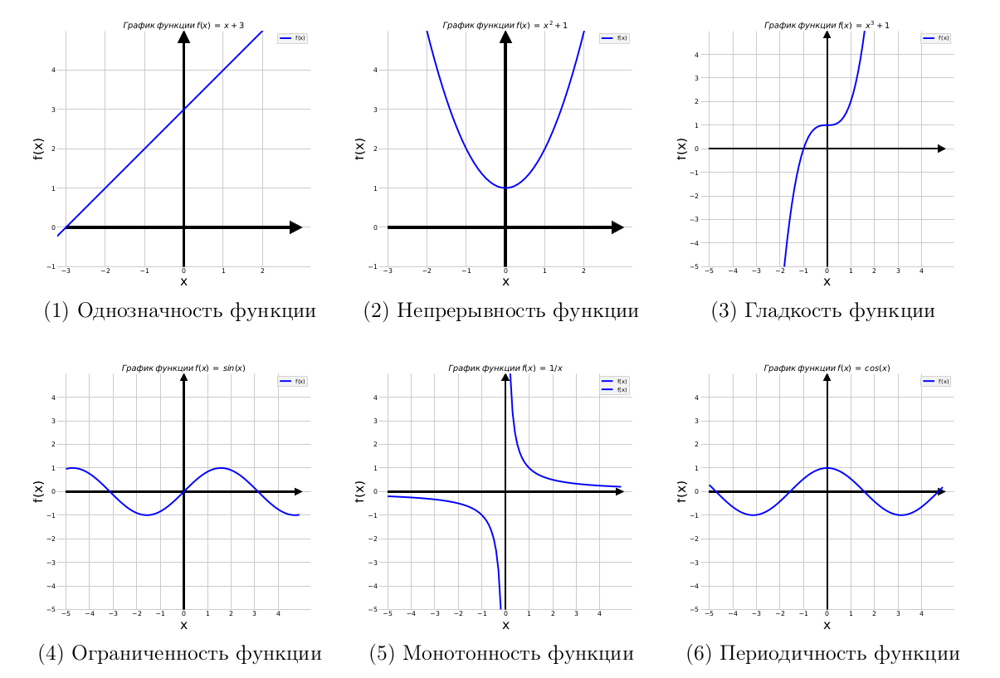
    <em>
    Иллюстрация основных свойств функций
    </em>
     
     
     

## Графики часто используемых функций
### Линейная функция
$f(x) = a \cdot x + b$

Свойства функции $y = a \cdot x + b$:
- **Гладкость**. Функция $y = a \cdot x + b$ гладкая на всей области определения, т. е. не имеет разрывов, углов и изломов.
- **Ограниченность**. Функция $y = a \cdot x + b$ не является ограниченной сверху или снизу на всей области определения, за исключением случая, когда $a = 0$. Тогда функция будет ограничена только снизу, если $b<0$, или ограничена только сверху, если $b>0$.
- **Монотонность**. Функция $y = a \cdot x + b$ может быть монотонной или не монотонной, в зависимости от знака коэффициента $a$. Если $a > 0$, то функция возрастает, если $a < 0$, то функция убывает. А если $a = 0$, то функция константа и является одновременно и неубывающей, и невозрастающей.
- **Периодичность**. Функция $y = a \cdot x + b$ не является периодической на всей области определения, за исключением случая, когда $a = 0$. Тогда функция является периодической с любым периодом, проходящим через ось абсцисс ($oX$).

График функции $f(x) = a \cdot x + b$ при $a=1$ и $b=3$:

    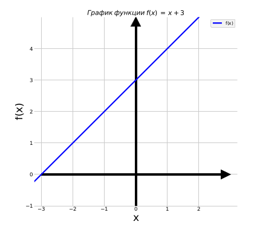
     
    <em>
    График линейной функции
    </em>
     
     

### Квадратичная функция
$f(x)=a \cdot x^2 + b$

Свойства функции $y=a \cdot x^2 + b$:
- **Гладкость**. Функция $y=a \cdot x^2 + b$ гладкая на всей области определения, т. е. имеет непрерывные производные любого порядка.
- **Ограниченность**. Функция $y=a \cdot x^2 + b$ может быть ограниченной сверху или снизу на всей области определения, в зависимости от знака коэффициента $a$ и значения $b$. Если $a > 0$, то функция ограничена снизу значением $b$ и не ограничена сверху. Если $a < 0$, то функция ограничена сверху значением $b$ и не ограничена снизу. Если $a = 0$, то функция является константой и ограничена сверху и снизу значением $b$.
- **Монотонность**. Функция $y=a \cdot x^2 + b$ не является монотонной на всей области определения.
- **Периодичность**. Функция $y=a \cdot x^2 + b$ не является периодической на всей области определения.

График функции $f(x)=a \cdot x^2 + b$ при $a=1$ и $b=1$:

    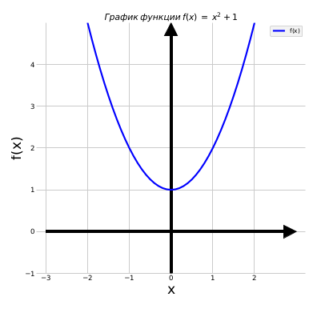
     
    <em>
    График квадратичной функции
    </em>
     
     

### Кубическая функция
$f(x)=a \cdot x^3 + b$

Свойства функции $y = a \cdot x^3 + b$:
- **Гладкость**. Функция $y = a \cdot x^3 + b$ гладкая на всей области определения, т. е. имеет непрерывные производные любого порядка.
- **Ограниченность**. Функция $y = a \cdot x^3 + b$ не ограничена ни сверху, ни снизу при любом $a \neq 0$. При $a>0$ функция возрастает на всей области, при $a<0$ убывает на всей области.
- **Монотонность**. Функция $y = a \cdot x^3 + b$ может быть монотонной или не монотонной, в зависимости от знака коэффициента $а$. Если $a > 0$, то функция возрастает на всей области определения, если $a < 0$, то функция убывает на всей области определения, а если $a = 0$, то функция константа и не является монотонной.
- **Периодичность**. Функция $y = a \cdot x^3 + b$ не является периодической на всей области определения.

График функции $f(x)=a \cdot x^3 + b$ при $a = 1$ и $b = 1$:

    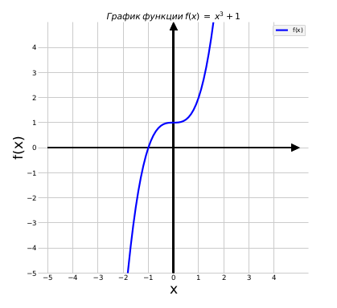
     
    <em>
    График кубической функции
    </em>
     
     

### Гиперболическая функция (функция обратной пропорциональности)
$f(x) = \large\frac{1}{x}$

Свойства функции $f(x) = \large\frac{1}{x}$:
- **Гладкость**. Функция $f(x) = \large\frac{1}{x}$ не является гладкой на всей области определения, так как имеет вертикальную асимптоту в точке $x = 0$, где она не определена. Однако на любом интервале, не содержащем точку $x = 0$, функция гладкая и имеет непрерывные производные любого порядка.
- **Ограниченность**. Функция $f(x) = \large\frac{1}{x}$ не является ограниченной на своей области определения, так как ее значения могут стать очень большими, если $x$ близко к 0. Например, при $x=0.0001$, значение функции будет равно 10000, а при $x=0.00001−100000$. Таким образом, функция не имеет ограничений ни сверху, ни снизу.
- **Монотонность**. Функция $f(x) = \large\frac{1}{x}$ является монотонно убывающей на своей области определения, так как при увеличении аргумента $x$, ее значение убывает. Формально, для любых двух точек $x_1$ и $x_2$ на своей области определения, если $x_1 < x_2$, то $f(x_1) > f(x_2)$.
- **Периодичность**. $f(x) = \large\frac{1}{x}$ не является периодической на своей области определения, так как ее значения зависят только от значения аргумента $x$ и не повторяются через равные интервалы.

График функции $f(x) = \large\frac{1}{x}$:

    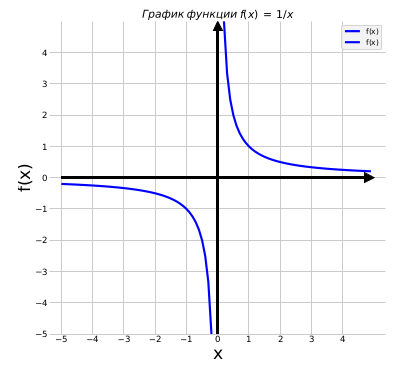
     
    <em>
    График гиперболической функции
    </em>
     
     

### Тригонометрическая функция синус
$f(x) = \sin(x)$

Свойства функции $f(x) = \sin(x)$:
- **Гладкость**. Функция $\sin(x)$ бесконечно дифференцируема на всей числовой оси. Это означает, что ее производные любого порядка существуют везде на числовой оси и непрерывны.
- **Ограниченность**. Функция $\sin(x)$ ограничена сверху и снизу значениями от -1 до 1. Таким образом, ее значения не могут превышать этих границ.
- **Монотонность**. Функция $\sin(x)$ не является монотонной на всей числовой оси, поскольку имеет периодическую структуру. Однако на каждом периоде функция $\sin(x)$ является ограниченной и возрастающей на первой половине периода и убывающей на второй половине периода.
- **Периодичность**. Функция $\sin(x)$ периодическая с периодом $2\pi$. Это означает, что для любого x значение функции $\sin(x)$ будет равно значению функции $\sin(x + 2\pi)$, $\sin(x + 4\pi)$, $\sin(x − 2\pi)$ и т. д.

График функции $f(x) = \sin(x)$:

    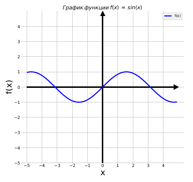
     
    <em>
    График тригонометрической функция синус
    </em>
     
     

### Тригонометрическая функция косинус
$f(x) = \cos(x)$

Свойства функции $f(x) = \cos(x)$:
- **Гладкость**. Функция $\cos(x)$ является бесконечно дифференцируемой на всей числовой оси, что означает, что она гладкая на любом интервале.
- **Ограниченность**. Функция $\cos(x)$ ограничена сверху и снизу значениями от -1 до 1, т.е. $|\cos(x)| <= 1$ для любого $x$.
- **Монотонность**. Функция $\cos(x)$ не является монотонной на всей числовой оси, так как она пересекает ось $x$ бесконечное число раз. Однако на каждом периоде функция $\cos(x)$ монотонно убывает с увеличением $x$ на первой половине периода, и монотонно возрастает на второй половине.
- **Периодичность**. Функция $\cos(x)$ является периодической с периодом $2\pi$, т.е. $\cos(x + 2\pi) = \cos(x)$ для любого $x$.

График функции $f(x) = \cos(x)$:

    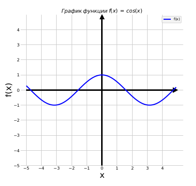
     
    <em>
    График тригонометрической функции косинус
    </em>
     
     

### Показательная функция
$f(x) = e^x$

Свойства функции $f(x) = e^x$:
- **Гладкость**. Функция $e^x$ является бесконечно дифференцируемой на всей числовой оси, что означает, что она гладкая на любом интервале.
- **Ограниченность**. Функция $e^x$ неограничена сверху, но ограничена снизу нулем, т. е. $e^x > 0$ для любого $x$.
- **Монотонность**. Функция $e^x$ монотонно возрастает на всей числовой оси. Это означает, что с увеличением $x$ значение функции $e^x$ также увеличивается.
- **Периодичность**. Функция $e^x$ не является периодической на всей числовой оси.

График функции $f(x) = e^x$:

    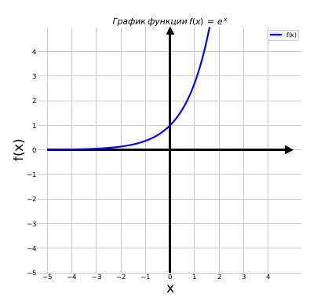
     
    <em>
    График показательной функции
    </em>
     
     

### Логарифмическая функция
$f(x) = \ln(x)$

Свойства функции $f(x) = \ln(x)$:
- **Гладкость**. Функция $\ln(x)$ гладкая на всей области определения $(x > 0)$, то есть она бесконечно дифференцируема.
- **Ограниченность**. Функция $\ln(x)$ неограничена сверху, но ограничена снизу нулем, то есть $\ln(x) > 0$ для $x > 1$ и $ln(1) = 0$.
- **Монотонность**. Функция $\ln(x)$ монотонно возрастает на всей области определения, то есть если $x_1 < x_2$, то $ln(x_1) < ln(x_2)$.
- **Периодичность**. Функция $\ln(x)$ не является периодической на всей числовой оси.

График функции $f(x) = \ln(x)$:

    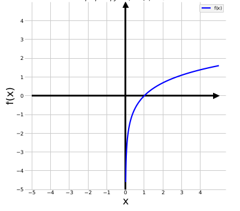
     
    <em>
    График логарифмической функции
    </em>
     
     

## Обратные функции
**Обратная функция** — это функция, которая превращает выходное значение одной функции в ее входное значение. Другими словами, если $y = f(x)$, то обратная функция $f^{−1}(y)$ определяет значение $x$ в терминах $y$.

Некоторые обратные функции часто используются в математике:

- Обратная функция синуса: $\sin^{−1}(y)$ или $\arcsin(y)$ — это функция, которая возвращает угол в радианах, соответствующий значению y в интервале [−1,1].

- Обратная функция косинуса: $\cos^{−1}(y)$ или $\arccos(y)$ — это функция, которая возвращает угол в радианах, соответствующий значению y в интервале [−1,1].

- Обратная функция тангенса: $\tan^{−1}(y)$ или $\arctan(y)$ — это функция, которая возвращает угол в радианах, соответствующий значению y в интервале [$−\infty, +\infty$].

- Обратная функция экспоненты: $\log(y)$ или $\ln(y)$ — это функция, которая возвращает значение $x$ в интервале [$−\infty, +\infty$], такое, что $y = e^x$.

- Обратная функция логарифма: $\exp(y)$ — это функция, которая возвращает значение $x$ в интервале [$0, +\infty$], такое, что $y = \ln(x)$.

- Обратная функция гиперболического синуса: $\sinh^{−1}(y)$ или $\operatorname{arsinh}(y)$ — это функция, которая возвращает значение $x$ в интервале [$−\infty, +\infty$], такое, что $у = \sinh(x)$.

- Обратная функция гиперболического косинуса: $\cosh^{−1}(y)$ или $\operatorname{arcosh}(y)$ — это функция, которая возвращает значение $x$ в интервале [$0, +\infty$], такое, что $y = \cosh(x)$.

- Обратная функция гиперболического тангенса: $\tanh^{−1}(y)$ или $\operatorname{artanh}(y)$ — это функция, которая возвращает значение $x$ в интервале [−1, 1], такое, что $y = \tanh(x)$.

Обратные функции играют важную роль в анализе и решении уравнений, особенно когда функции не могут быть решены аналитически.

# Математический анализ: производные
## Определение производной
**Производная** — это понятие, используемое в математике для описания того, как быстро изменяется функция в каждой точке. Если мы говорим о функции, которая описывает зависимость одной переменной от другой, то производная показывает, как быстро изменяется значение функции с изменением ее аргумента в каждой точке.

Более формально, производная функции определяется как предел отношения приращения функции к приращению ее аргумента при стремлении приращения аргумента к нулю:

$\large
f'(x) = \frac{f(x + \Delta{x}) - f(x)}{\Delta{x}}, \\
$

$
\text{где } \boldsymbol{\Delta(x)}\text{ - бесконечно малое приращение аргумента.}
$

Эта формула показывает, как быстро изменяется функция $f(x)$ в точке $x$. Если производная положительна, то функция возрастает в этой точке, если отрицательна — функция убывает. Если производная равна нулю, то функция имеет экстремум (максимум или минимум) в этой точке.

Производная имеет много приложений в математике и науке, так как она позволяет описать изменение величин в различных процессах и является ключевым инструментом для решения многих задач.

Производные функций широко используются в машинном обучении. Например, производные могут использоваться для оптимизации функций потерь при обучении нейронных сетей. Оптимизация функций потерь требует нахождения экстремумов функции, что может быть сделано путем вычисления производных и использования методов оптимизации, таких как градиентный спуск. Производные также могут использоваться для нахождения экстремумов функций при обучении моделей машинного обучения, таких как линейная регрессия и логистическая регрессия.

Существует несколько способов записи производной функции. Наиболее распространенные из них:

 - **Производная в нотации Лейбница (обычная форма)**: $\large\frac{dy}{dx}$. Здесь $y$ — это функция от $x$, а дробь указывает на производную функции $y$ по переменной $x$. Если нужно указать производную более высокого порядка, то можно использовать следующую запись: $\large\frac{d^n y}{dx^n}$. Здесь $n$ указывает на порядок производной.

 - **Производная в нотации Лагранжа**: $f^{(n)}(x_0)=\large\frac{n!}{2\pi i}\oint_{\gamma}\frac{f(z)}{(z - x_0)^{n + 1}} d z$. Здесь $f^{(n)}(x_0)$ означает $n$-ую производную функции $f(x)$ в точке $x_0$, $\gamma$ — контур, ограничивающий область, содержащую точку $x_0$.

 - **Производная в инфиксной нотации**: $y'(x)$ или $f'(x)$. Эта запись эквивалентна нотации Лейбница $\large\frac{dy}{dx}$.

 - **Дифференциал функции**: $df = f'(x)dx$. Эта запись означает дифференциал функции $f(x)$, который можно представить как произведение производной $f'(x)$ и бесконечномалого приращения $dx$.

Выбор записи производной зависит от предпочтений и требований к форматированию в конкретном случае.

Геометрическая интерпретация производной функции заключается в том, что производная в точке определяет скорость изменения функции в этой точке.

    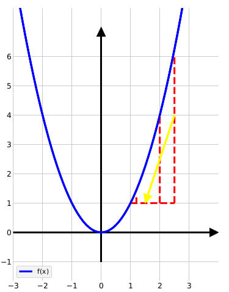
     
    <em>
    Геометрическая интерпретация производной
    </em>
     
     

При стремлении приращения аргумента $x$ $\color{red}\text{(красные пунктирные линии)}$ к нулю отношение приращения функции к приращению аргумента будет все точнее отражать скорость роста функции в точке.

В машинном обучении геометрическая интерпретация производной имеет множество применений. Например, она может использоваться в оптимизации функций потерь, которые определяют, насколько хорошо модель машинного обучения соответствует данным. Методы оптимизации (например, градиентный спуск) используют производную для нахождения минимума функции потерь и оптимизации параметров модели.

Если мы рассмотрим график функции $y=f(x)$, то производная функции $f'(x)$ в каждой точке графика показывает наклон касательной к этой точке графика. **Если производная положительна**, **то наклон** касательной **положительный**, что означает, что **функция в этой точке возрастает**. **Если производная отрицательна**, **то наклон** касательной **отрицательный**, что означает, что **функция в этой точке убывает**. **Если производная равна нулю**, то касательная к графику функции является горизонтальной и **функция имеет экстремум (максимум или минимум) в этой точке**.

    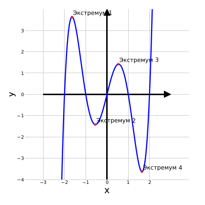
     
    <em>
    Нахождение экстремумов — одна из основных задач производных
    </em>
     
     

Задачи машинного обучения связаны с оптимизацией параметров модели — чтобы минимизировать ошибку на тренировочных данных или максимизировать некоторую функцию потерь. Нахождение экстремумов функций помогает найти оптимальные значения этих параметров.

Если график функции $y = f(x)$ имеет касательную в точке $(a, f(a))$, то производная функции в этой точке равна тангенсу угла наклона касательной к графику в этой точке. Пусть $m$ — угол наклона касательной к графику функции $y = f(x)$ в точке $(a, f(a))$. Тогда, если мы рассмотрим малый прирост аргумента $\Delta x$ и соответствующий прирост функции $\Delta y$, то получим следующее:

$\large
\tan m = \lim_{\Delta x \to 0} \frac{\Delta y}{\Delta x}
$

Если существует производная функции $f(x)$ в точке $a$, то этот предел существует и равен значению производной $f'(a)$, т. е.

$
\tan m = f'(a)
$

Таким образом, производная функции в точке касания графика касательной к этому графику равна тангенсу угла наклона касательной в этой точке.

## Определение градиента
**Градиент** — вектор частных производных этой функции по каждому из аргументов, показывающий направление наибольшего возрастания функции и величину изменения функции в этом направлении в заданной точке.

Градиент обозначается с помощью символа $\nabla$(«набла»). Градиент функции указывает направление наибольшего ее роста относительно параметров, задающих функцию, и с помощью градиента можно искать ее экстремумы. Если функция дифференцируема в экстремуме, то градиент в этой точке равен нулю.

**Некоторые свойства градиентов:**

- **Абсолютное значение градиента** отражает крутизну участка функции в окрестностях заданной точки.
- **Положительный знак градиента** означает, что при увеличении значений параметров значение функции увеличится.
- **Нулевой градиент** не обязательно указывает на наличие экстремума: градиент также обращается в ноль в седельных точках и на плоских участках функций, что может приводить к проблемам при обучении моделей.
- **Градиент может быть вычислен аналитически**. В некоторых случаях градиент функции может быть выражен в явном виде, что упрощает процесс оптимизации (например, в случае линейной регрессии).
- **Для сложных функций**, какими зачастую являются функции потерь в машинном обучении, используются численные методы нахождения минимальных значений функции, такие как автоматическое дифференцирование или символьное дифференцирование.

    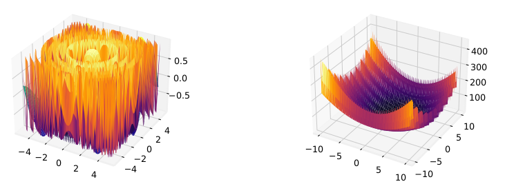
     
    <em>
    Примеры сложных функций потерь
    </em>
     
     

- **Градиент направлен перпендикулярно линии уровня в определенной точке функции**. Линия уровня функции — это множество точек в ее области определения, в которых значение функции остается постоянным, т.е. все точки на линии имеют одинаковое значение функции.

    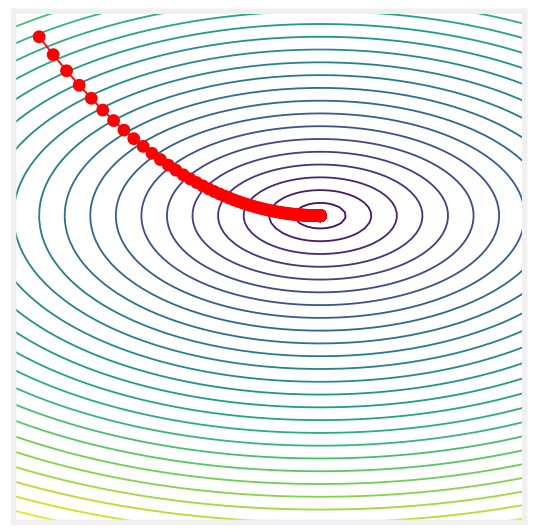
     
    <em>
    Градиент перпендикулярен линии уровня
    </em>
     
     

## Недифференцируемые функции
**Недифференцируемая функция** — это функция, которая не имеет производной в какой-либо точке своей области определения. То есть производная функции не существует в этой точке, либо существует, но не является конечной.

**Примеры недифференцируемых функций**. Любая функция, в которой есть углы, будет недифференцируема в точке нахождения угла. Функция модуля знака $|x|$ является недифференцируемой в нуле, так как ее производная не существует в этой точке. Если попытаться провести касательную, она будет определена неоднозначно.

    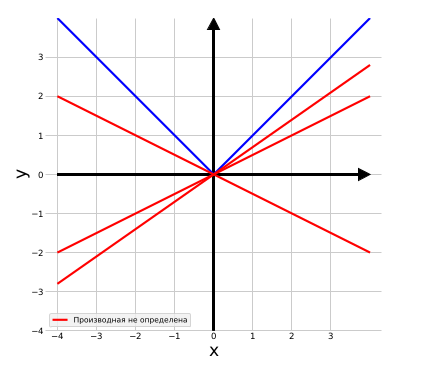
     
    <em>
    Функция
    </em>
    |x|
    <em>
    недифференцируема в точке 0
    </em>
     
     

**Разрывные функции** — функции, имеющие разрыв в некоторых точках, также недифференцируемы в этих точках.

    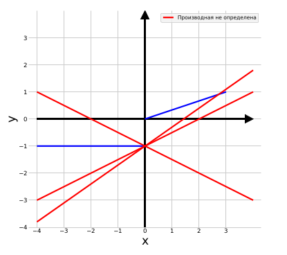
     
    <em>
    Разрывная (кусочно-линейная) функция недифференцируема в точке 0
    </em>
     
     

Функции являются недифференцируемыми в точках, где тангенс имеет вертикальные асимптоты. Это происходит потому, что в таких точках производная функции не существует.

Например, функция тангенса имеет вертикальные асимптоты в точках $\large\frac{\pi}{2}+k\pi$, где $k$ — любое целое число. В этих точках тангенс стремится к бесконечности, и производная функции не существует.

    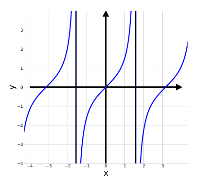
     
    <em>
    Разрывная (кусочно-линейная) функция недифференцируема в точке 0
    </em>
     
     

Соответственно, функция является недифференцируемой, если:
 - имеются углы
 - имеются разрывы
 - имеются точки с вертикальными асимптотами тангенса

Недифференцируемые функции могут вызывать некоторые проблемы при решении математических задач и приложений. Некоторые из проблем, связанных с недифференцируемыми функциями, включают:

 - **Ограничение области определения.** Некоторые задачи требуют дифференцируемых функций, и использование недифференцируемых функций может ограничить область определения их применения.
 - **Сложность вычислений.** Недифференцируемые функции могут быть более сложными в вычислении, так как их производные могут иметь особенности — например, разрывы или бесконечные значения.
 - **Несуществование градиента.** В некоторых задачах оптимизации требуется нахождение градиента функции, и недифференцируемые функции могут быть проблемой, так как градиент не существует в некоторых точках.
 - **Необходимость использования других методов.** Некоторые задачи могут требовать анализа недифференцируемых функций, и для их решения может потребоваться использование других методов. Например, методов интегрального и функционального анализа.

## Правила дифференцирования
Основные правила дифференцирования:

- **Сумма производных:**

  - $\large{(f(x) + g(x))' = f'(x)+g′(x)}$

- **Разность производных:**

  - $\large{(f(x) − g(x))' = f'(x) − g'(x)}$

- **Произведение производных:**

  - $\large{(f(x) \cdot g(x))' = f'(x) \cdot g(x) + f(x) \cdot g'(x)}$

- **Частное производных:**

  - $\large{\left(\frac{f(x)}{g(x)}\right)' = \frac{f'(x) \cdot g(x) - f(x) \cdot g' (x)}{[g(x)]^2}}$

- **Производная произведения функции на константу равна произведению константы и производной функции:**

  - $\large\left(cf(x)\right)' = cf'(x)$

- **Производная константы равна нулю:**

  - $\large\frac{d}{dx}[f(x) + C] = f'(x)$

- **Правило производной обратной функции - производная обратной функции равна обратной производной функции в точке обратимости:**

  - $\left(f^{-1}(y)\right)' = \large\frac{1}{f'(f^{-1}(y))}$

- **Правило цепочки — производная композиции функций равна произведению производной внешней функции и производной внутренней функции:**

  - $\large{\left(f(g(x))\right)' = f'(g(x)) \cdot g'(x)}$

  Это правило играет важную роль в машинном обучении. В нотации Лейбница оно может быть записано следующим образом:

  - $\large{\frac{df}{dx} = \frac{df}{dg} \cdot \frac{dg}{dx}}$

  Эта формула показывает, что производная сложной функции $f(g(x))$ равна произведению производной внешней функции $f'(g(x))$ и производной внутренней функции $g'(x)$. Например, если $\large f(x) = \sin(x^2)$ и $g(x) = x^2$, то
  - $\large\frac{df}{dx} = \frac{d}{dx} \cdot \sin(g(x)) = cos(g(x)) \cdot \frac{dg}{dx} = \cos(x^2) \cdot 2x$

  Это правило может быть использовано для дифференцирования более сложных функций, которые представляют собой композицию нескольких функций.

Эти правила могут быть расширены и использованы в более сложных случаях, но они образуют основу дифференцирования функций.

## Производные часто используемых функций
Ниже приведены производные часто используемых функций:

- **Константа:**
  - $\large{f'(C) = 0}$

- **Линейная функция:**
  - $\large{f'(ax + b) = a}$

- **Степенная функция:**
  - $\large{f'(x^n) = nx^{n-1}}$

- **Степенная функция с отрицательным целым показателем:**
  - $\large{f'(x^{-n}) = -nx^{-n-1}}$

- **Тригонометрические функции:**
  - $\large{f'(\sin(x)) = \cos(x)}$

  - $\large{f'(\cos(x)) = -\sin(x)}$

  - $\large{f'(\tan(x)) = \sec^2(x)}$

  Обратные тригонометрические функции:
  - $\large{f'(\arcsin(x)) = \frac{1}{\sqrt{1 - x^2}}}$

  - $\large{f'(\arccos(x)) = -\frac{1}{\sqrt{1 - x^2}}}$

  - $\large{f'(\arctan(x)) = \frac{1}{1 + x^2}}$

- **Экспоненциальная функция:**
  - $\large{f'(e^x) = e^x}$

- **Логарифмическая функция:**
  - $\large{f'(\ln(x)) = \frac{1}{x}}$

Эти производные могут быть использованы для нахождения производных более сложных функций, которые представляют собой композицию нескольких функций.
## Реализация в Python

# Заметки
## Функция потерь

$\large
L(a, x) = \left|a(x) - y(x)\right| - \text{абсолютная ошибка} \\
L(a, x) = \left(a(x) - y(x)\right)^2 - \text{квадратичная ошибка}
$

$
\text{где } \boldsymbol{a(x)}\text{ - предсказание модели (или }\hat{y}) \
\\ \ \ \ \ \ \ \boldsymbol{y(x)} \text{ — значение целевой метки}
$

## Средний эмпирический риск

$\large
Q(a, X^l) = \frac{1}{l} \sum^l_{i=1}{L(a, x_i)}
$
